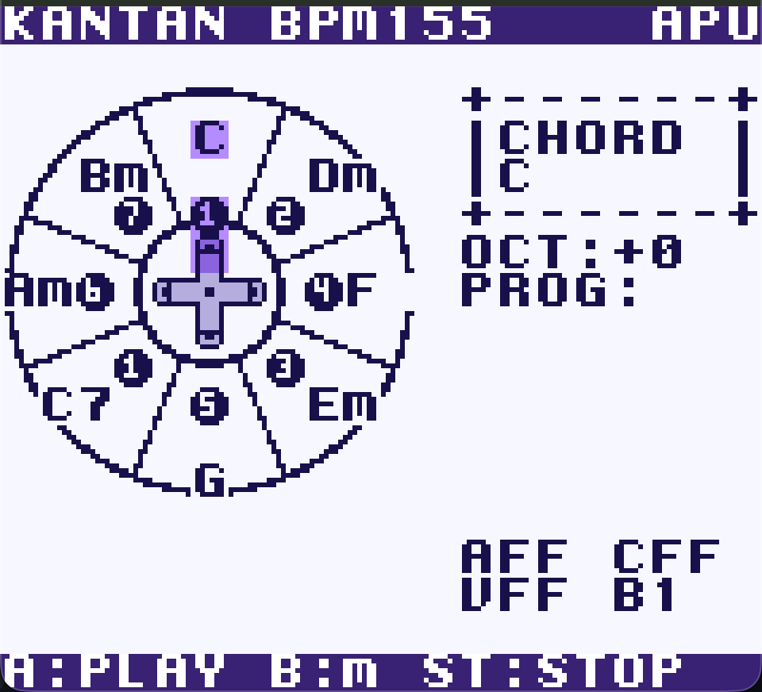

[English](README.md) | **日本語**

# KANTAN GB PLAY

ゲームボーイカラー用の和音（コード）演奏アプリROM。
[KANTAN Play](https://github.com/InstaChord/KANTAN_Play_core) の「degree + key → 和音」の考え方を踏襲し、十字キー8方向でコードを選んでAボタンで弾く楽器です。キーは C major 固定。



## ▶ ブラウザでいますぐ遊ぶ

[claude-gb-emu](https://github.com/GOROman/claude-gb-emu)（WASM版GBCエミュレータ）上で最新ROMを自動ロードして起動します:

**https://goroman.github.io/claude-gb-emu/?rom=https%3A%2F%2Fraw.githubusercontent.com%2FGOROman%2Fkantan-gb-play%2Fmain%2Fkantan-gb-play.gbc**

最新のビルド済みROMはルートの [`kantan-gb-play.gbc`](kantan-gb-play.gbc)、過去のビルドは [`roms/`](roms/) にあります。

## 操作方法

| 操作 | 機能 |
|---|---|
| 十字キー（8方向） | コード選択（斜めは同時押し）。押している間はベース＆リズムが継続 |
| A | コード発音（押している間鳴る。離すと次の8分グリッドで消音） |
| B | マイナースワップ発音（C→Cm、F→Fm など。A押下中の切替も可） |
| START | 全停止（パニック、即時） |

### SELECTボタン系

| 操作 | 機能 |
|---|---|
| SELECT＋↑ / ↓ | BPMを＋5 / −5（40〜240、初期140。上部バーに表示） |
| SELECT＋→ / ← | オクターブを＋1 / −1（8段階: −3〜+4。`OCT:` に表示） |
| SELECT＋A | デモモード（スペースハリアー風コード進行の自動再生、BPM155）。再度押すかSTARTで停止 |

- 発音・消音・ベース・リズムはすべてフリーランの8分音符グリッドにクォンタイズされます
- `PROG:` には直近に弾いた4コード（Fm等のスワップコード含む）がログ表示されます

## 画面

- 中央: 8花弁のコードホイール（円周にコード名、円内に①〜⑦のディグリー番号、中央に十字キー）。選択中は紫、発音中は緑
- 右: `CHORD`（現在のコード。ベースがCペダルのため C 以外は `Dm/C` のようなオンコード表記）、`OCT:`、`PROG:`
- 上部バー: BPMと音源（`APU` / `YM2151`）

## サウンド

- **GB APU（通常のGBC/エミュレータ）**: パルス2chでコード、三角波（CH3）で8分のオクターブベース（C2⇄C3、Cペダル）、ノイズ（CH4）で4つ打ち＋8小節ごとのフィル
- **YM2151（MODRETRO Chromatic FPGA拡張）**: 起動時に `FF2E == 0x51` を検出すると全パートがFM/ADPCMに切り替わります
  - CH0-2: コード3声 / CH4: ベース / CH3: FMハイハット
  - キック・スネア・クラッシュはMSM6258互換ADPCM（`FF28` エスケープ 0xFF/0xFE/0xFD、FIFOへ毎フレームストリーミング給送）
  - コード・ベースの音色はX68000版スペースハリアーMDXのOPMボイスパラメータ由来
  - ドラムサンプルは自前合成のオリジナル（`tools/gen_drums.py` で再生成可能）。手元のPDXの音に差し替える場合は `python3 tools/pdx2c.py <FILE.PDX> <kick> <snare> <crash>` をローカルで実行

## ビルド

[GBDK-2020](https://github.com/gbdk-2020/gbdk-2020) が必要です（`~/gbdk-install/gbdk` 想定、`make GBDK=...` で変更可）。

```sh
make            # build/kantan-gb-play.gbc を生成
make run        # mGBA で起動
make release    # roms/ にタイムスタンプ付きでコピーし、ルートの最新版を更新
```

技術詳細（アーキテクチャ、レジスタマップ、タイミング、GBDKの落とし穴）は [docs/TECHNICAL.ja.md](docs/TECHNICAL.ja.md) を参照。

## 構成

- `src/main.c` — メインループ（入力デバウンス、8分グリッド、デモシーケンス）
- `src/chord.c` — コードテーブル（KANTAN Music APIのCloseボイシング実出力、通常8＋スワップ8）
- `src/sound.c` — GB APUドライバ（C2〜B7周波数テーブル、コード/ベース/ドラム）
- `src/ym2151.c` — Chromatic拡張ドライバ（OPMボイス、KC変換、ADPCMストリーミング）
- `src/ui.c` — UI（ホイール、ハイライト、CHORD/PROG/BPM/OCT表示）
- `tools/` — タイル・サンプル生成スクリプト（Python）
